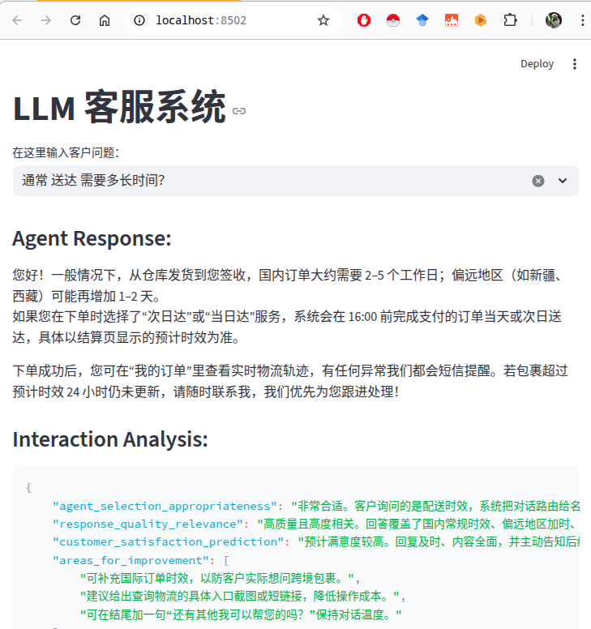

## 功能展示

#### 智能客服系统

1. 问题：learn_from_interaction 并没有老知识库输入进行对比，算不上是学习新知识。

#### 创意写作系统

1. **创意写作系统**： 使用多个角色 进行脑暴然后产生不同视角的想法，然后选择其中一种想法来让不同角色提出评价、改进建议，最后由一个综合指令来合并这些评价、改进建议。
2. **解决版本冲突**：使用LLM来解决 文本文档的不同版本之间的冲突，即通过LLM指令来合并两个文档，并且使得合并结果前后一致且具有逻辑性。
3. **风格一致性保证**： 在老文档版本的基础上，对于新的文档版本进行改写，使得再风格上与老文档版本保持一致，同时从多角度来分析新老文档的一致性和修改建议。

#### 复杂问题分解系统

1. **分解问题功能**
    1. `Return your integrated result as a compact JSON object with these sections as keys.`
        1. 增加 compact描述词，避免生成 带换行符的json字符串，从而免去后续 json解码 的麻烦。
2. **整合验证功能**
    1. 针对子问题和子方案进行整合，并使用LLM对整合结果进行一致性、是否解决目标问题等方面进行评估。
3. **多层次推理功能**
    1. 评估子方案的直接影响、间接影响、对周边关联系统的影响，通过LLM指令来实现多级影响的分析。

#### 学习助手系统

1. **个性化学习助手**
    1. 设置目标
    2. 生成学习路径（即若干学习活动）
    3. 完成某一项学习活动
        1. 即将学习活动加入已经完成的学习记录
        2. 根据已经完成额学习记录历史和学习目标来产生学习进度，即学习进度数值、学习速度、欠缺的地方、改进的地方等。
    4. 获取下一项学习活动
        1. 即根据学习进度 来生成若干学习活动，并选择第一个活动进行处理。
    5. 备注： 要求生成json，但回复中可能包含了 表示代码块的反引号，需要去除。
2. **学习策略智能体**
    1. 使用不同的学习策略智能体，来提供适应性的学习策略和具体学习计划。
3. **学习测验实时反馈**
    1. 给出题库，用户给出答案，使用LLM来评估用户的答案，给出用户学习的一些问题，包括打分、答案提示、下一步学习建议。

#### 智能城市管理系统

1. **城市管理报告**：
    1. 综合不同数据源数据输出整合报告，分析整合报告挖掘城市管理的潜在问题。
2. **不同部门分析整合报告并给出决策**：
    1. 针对 城市状态的整合报告，让不同的agent(代表不同的城市管理部门)来提供对应的处理决策。
    2. 问题：LLM返回的response有时候不能百分之百符合 json格式的要求。
3. **调配资源处理紧急事件**：
    1. 定义城市的可用资源，在处理应急事件的时候，对于生成的处理决策，从中提取需要的资源及其数量，然后从可用资源中扣除需求数量，从而完成紧急事件的处理。

