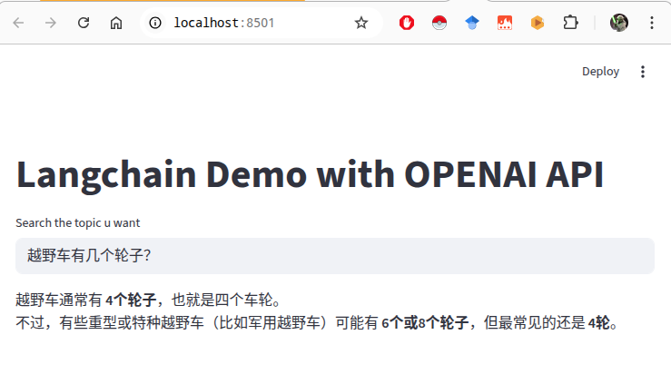
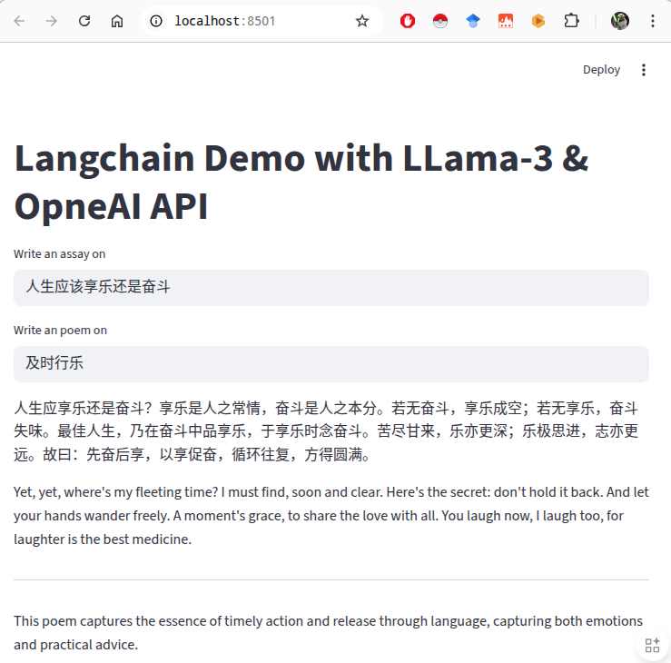
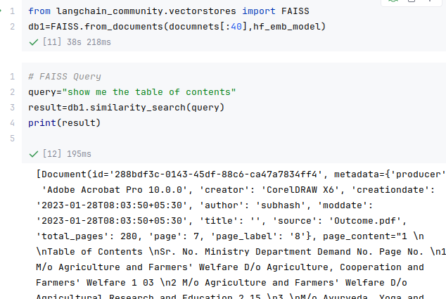

## 环境构建

使用uv来构建。

## Project 01 chatbot （LLM模型调用方式）
1. app.py
    1. langchain + openai sdk + kimi k2 的OpenAI兼容api
    2. 调用chain为 `ChatPromptTemplate | Kimi K2 LLM API | StrOutputParser`
2. local_llama.py
    1. langchain + Ollama sdk + Ollama 本地模型服务 + LangSmith tracing服务
    2. 调用chain为 `ChatPromptTemplate | Ollama local LLM API (deepseek-r1:1.5b) | StrOutputParser`

```bash
streamlit run Project\ 01\ chatbot/app.py
```



```bash
# 安装ollama
# 下载模型
ollama pull deepseek-r1:1.5b

streamlit run Project\ 01\ chatbot/local_llama.py
```


## Project 02 APIs（prompt模板和chat接口）

1. app.py
    1. fastapi 包装两个模型
        1. openai sdk + kimi k2 的OpenAI兼容api
        2. Ollama local LLM API (deepseek-r1:1.5b)
    2. prompt调用chain + fastapi + uvcorn 提供服务

```bash
# 运行服务
python Project\ 02\ APIs/app.py
# 提供界面
streamlit run Project\ 02\ APIs/client.py
```



## Project 03 RAG pipeline （RAG处理流水线）

1. 文档加载器 + splitter + embedding 服务 + 向量数据库
    1. langchain 文本加载器(textloader) + 网页加载器(webbaseloader) + pdf文件加载器(pypdfloader)
    2. RecursiveCharacterTextSplitter
    3. HF embedding服务接口（HuggingFaceBgeEmbeddings "BAAI/bge-large-zh-v1.5"）
    4. 向量数据库ChromaDB
    5. 向量数据库FAISS
    6. 最终通过向量数据库接口做相似性性检索



## Project 04 Retriever and Chain （RAG检索处理链条）

1. 文档加载器 + splitter + embedding 服务 + 向量数据库
    1. langchain 文本加载器(textloader) + 网页加载器(webbaseloader) + pdf文件加载器(pypdfloader)
    2. RecursiveCharacterTextSplitter
    3. HF embedding服务接口（HuggingFaceBgeEmbeddings "BAAI/bge-large-zh-v1.5"）
    4. 向量数据库FAISS
2. 构建chain
    1. 向量数据库FAISS
    2. Ollama local LLM API (deepseek-r1:1.5b)
    3. ChatPromptTemplate (包含 context和input 槽)
    4. **最终构建出 chain （向量数据库 | prompt | LLM）**


