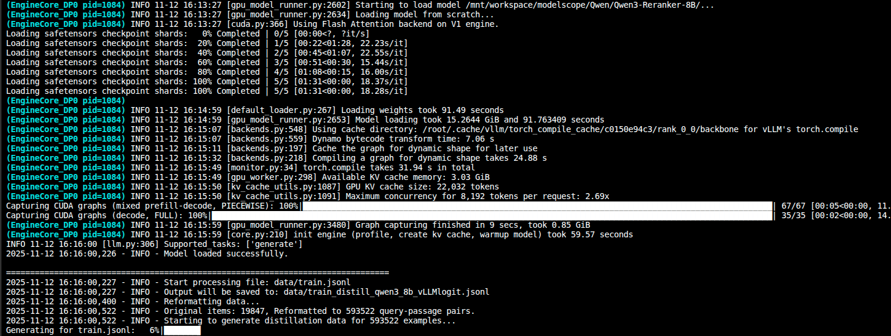
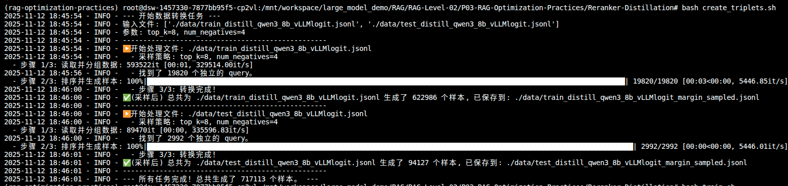
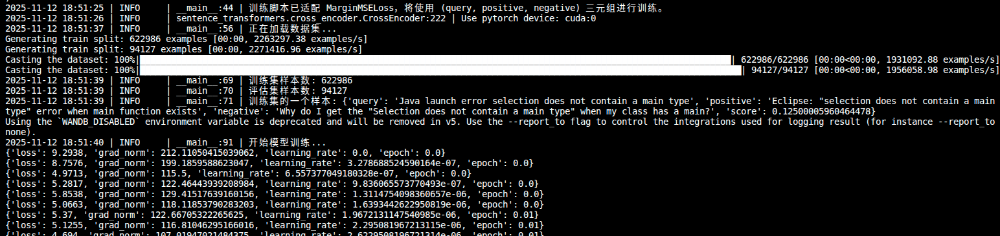
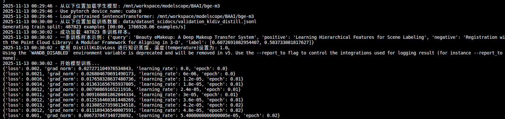

# 运行
在GPU服务器上运行该项目。

依次运行

## **Reranker-Distillation**

```bash
#切换解释器
source .venv/bin/activate
cd Embedding-Distillation
# 1. 运行 prepare.ipynb

# 2. 生成logitsdataview 
bash generate_logits.sh

# 3. 创建三元组训练数据
bash create_triplets.sh

# 4. 训练
bash train.sh

# 5. 评估
bash evaluate.sh
```

生成logtis过程









## **Embedding-Distillation**

```bash
#切换解释器
source .venv/bin/activate
cd Embedding-Distillation
# 1. 运行 prepare.ipynb

# 2. 生成logitsdataview 
bash generate_logits.sh

# 3. 创建三元组训练数据
bash create_triplets.sh

# 4. 训练
bash train.sh

# 5. 评估
bash evaluate.sh
```





```Python
(rag-optimization-practices) root@dsw-1457330-845c588466-dwlc9:/mnt/workspace/large_model_demo/RAG/RAG-Level-02/P03-RAG-Optimization-Practices/Embedding-Distillation# bash evaluation.sh 
============================================================
模型性能对比评估
============================================================

------------------------------
领域内数据集评估
------------------------------

正在加载模型: /mnt/workspace/modelscope/BAAI/bge-m3
正在加载数据集: data/dataset_scidocs/test.jsonl
成功加载 3978 条样本
开始评估...
Batches: 100%|██████████████████████████████████████████████████████████████████████████████████████████████████████████████████████████████████████████████████| 63/63 [00:06<00:00,  9.34it/s]
Batches: 100%|██████████████████████████████████████████████████████████████████████████████████████████████████████████████████████████████████████████████| 1854/1854 [03:29<00:00,  8.85it/s]

正在加载模型: output/checkpoint-477
正在加载数据集: data/dataset_scidocs/test.jsonl
成功加载 3978 条样本
开始评估...
Batches: 100%|██████████████████████████████████████████████████████████████████████████████████████████████████████████████████████████████████████████████████| 63/63 [00:06<00:00,  9.28it/s]
Batches: 100%|██████████████████████████████████████████████████████████████████████████████████████████████████████████████████████████████████████████████| 1854/1854 [03:34<00:00,  8.63it/s]

------------------------------
领域外数据集评估
------------------------------

正在加载模型: /mnt/workspace/modelscope/BAAI/bge-m3
正在加载数据集: data/dataset_stackoverflowdupquestions/test.jsonl
成功加载 2992 条样本
开始评估...
Batches: 100%|██████████████████████████████████████████████████████████████████████████████████████████████████████████████████████████████████████████████████| 47/47 [00:04<00:00, 10.51it/s]
Batches: 100%|██████████████████████████████████████████████████████████████████████████████████████████████████████████████████████████████████████████████| 1398/1398 [01:56<00:00, 12.03it/s]

正在加载模型: output/checkpoint-477
正在加载数据集: data/dataset_stackoverflowdupquestions/test.jsonl
成功加载 2992 条样本
开始评估...
Batches: 100%|██████████████████████████████████████████████████████████████████████████████████████████████████████████████████████████████████████████████████| 47/47 [00:04<00:00, 10.15it/s]
Batches: 100%|██████████████████████████████████████████████████████████████████████████████████████████████████████████████████████████████████████████████| 1398/1398 [01:57<00:00, 11.88it/s]

============================================================
领域内数据集 性能对比
============================================================
指标                 蒸馏前         蒸馏后        绝对变化     相对变化(%)
------------------------------------------------------------
map             0.7744      0.8516     +0.0773       +9.98
mrr@10          0.9321      0.9548     +0.0227       +2.43
ndcg@10         0.8296      0.8956     +0.0660       +7.96

============================================================
领域外数据集 性能对比
============================================================
指标                 蒸馏前         蒸馏后        绝对变化     相对变化(%)
------------------------------------------------------------
map             0.5166      0.5034     -0.0132       -2.56
mrr@10          0.5238      0.5110     -0.0127       -2.43
ndcg@10         0.5902      0.5778     -0.0124       -2.10

评估完成
```


# 具体机制

## reranker-Distillation

1. 环境配置
    1. A10 GPU（显存24G）
2. 整体步骤
    1. generate_logits 生成59万条数据，运行时长（250min）。
        1. 即针对  query doc 生成一个logprob分数，即 `(query, passage, score)`。
        2. logprob分数利用了 prompt模板 + LLM的chat接口 进行打分。
        3. prompt 限制了输出token的范围为 两个token （yes or no） 。 prompt模板如下
            1. `Judge whether the Document meets the requirements based on the Query and the Instruct provided. Note that the answer can only be "yes" or "no". `
            2. `<Instruct>: {instruction}\n<Query>: {query}\n<Document>: {doc}`
            3. 其中 instruct变量为 `Given a web search query, retrieve relevant passages that answer the query`
    2. 三元组蒸馏数据
        1. 生成三元组蒸馏数据 `(query, positive passage, negative passage, logits_diff)`
    3. 训练
        1. 利用 embedding小模型 + 三元组蒸馏数据 进行训练，将领域知识蒸馏进小模型。
    4. 评估


```Python
# prompt格式
message = [
    {"role": "system", "content": "Judge whether the Document meets the requirements based on the Query and the Instruct provided. Note that the answer can only be \"yes\" or \"no\"."},
    {"role": "user", "content": f"<Instruct>: {instruction}\n<Query>: {query}\n<Document>: {doc}"}
]

#LLM采样参数，只允许 yes 和 no 选项的logpro输出。
    # 定义固定的 token 和采样参数
    true_token = tokenizer("yes", add_special_tokens=False).input_ids[0]
    false_token = tokenizer("no", add_special_tokens=False).input_ids[0]
    sampling_params = SamplingParams(
        temperature=0,
        max_tokens=1,
        logprobs=20,
        allowed_token_ids=[true_token, false_token],
    )
```


```bash
# reranker 蒸馏训练之后的评估结果
(rag-optimization-practices) root@dsw-1457330-845c588466-dwlc9:/mnt/workspace/large_model_demo/RAG/RAG-Level-02/P03-RAG-Optimization-Practices/Reranker-Distillation# bash evaluate.sh 
正在从 data/test.jsonl 加载数据集...
加载完成！共 2992 条样本。

--- 正在加载并评估模型: /mnt/workspace/modelscope/BAAI/bge-reranker-v2-m3 ---
--- 正在加载并评估模型: ./output/checkpoint-1217 ---
==================================================
✅ 最终评估结果汇总
==================================================

【蒸馏前】模型性能:
  - MAP: 0.472061
  - MRR@10: 0.478234
  - NDCG@10: 0.547284

【蒸馏后】模型性能:
  - MAP: 0.564523
  - MRR@10: 0.573106
  - NDCG@10: 0.638634
==================================================
🚀 性能变化分析 (蒸馏后 vs. 蒸馏前)
==================================================
指标 [MAP]:
  - 绝对提升: +0.092462
  - 相对提升: +19.59% ↑
指标 [MRR@10]:
  - 绝对提升: +0.094872
  - 相对提升: +19.84% ↑
指标 [NDCG@10]:
  - 绝对提升: +0.091349
  - 相对提升: +16.69% ↑
评估完成！✨
```


-----------------

项目原始文档

# RAG 优化实践 (RAG Optimization Practices)
<p align="center">
  <a href="https://pytorch.org/" target="_blank"> </a>
  <a href="https://www.sbert.net/" target="_blank"> </a>
</p>

## 🚀 项目简介

本项目旨在分享 **RAG (检索增强生成) 优化** 的实践经验。

## 📂 项目结构

```
/RAG-Optimization-Practices
├── 📄 README.md                         <-- 你正在看的主页
│      
├── 📁 Reranker-Distillation/             (✅ 已完成)
│   ├── README.md                       # Reranker 蒸馏模块的详细说明
│   ├── generate_logits.sh              # 步骤1: 教师模型生成Logit分数
│   ├── create_triplets.sh              # 步骤2: 构建训练样本
│   ├── train.sh                        # 步骤3: 训练学生模型
│   └── evaluation.sh                   # 步骤4: 评测性能
│
├── 📁 Embedding-Distillation/            (✅ 已完成)
│   ├── README.md                       # Embedding 蒸馏模块的详细说明
│   ├── generate_distillation_data.sh   # 步骤1: 教师模型生成蒸馏分数
│   ├── train.sh                        # 步骤2: 训练学生模型
│   └── evaluation.sh                   # 步骤3: 评测性能
│
├── 📁 Query-Expansion-RL/                (⏳ 规划中)
└── 📁 Milvus-Optimization/               (⏳ 规划中)
```

-----

## ✅ 已完成模块

### 模块一：Reranker 知识蒸馏

本项目的第一部分，实践如何将SOTA重排序模型（教师模型：`Qwen3-Reranker-8B`）的知识地蒸馏到一个 0.6B 的轻量级模型（学生模型：`BAAI/bge-reranker-v2-m3`）上。

#### 核心成果：性能显著提升

不依赖人工标注，通过知识蒸馏，学生模型在 `stackoverflowdupquestions-reranking` 数据集上的性能获得了**近 20% 的相对提升**。

| 指标 (Metric) | 蒸馏前 (原始) | 蒸馏后 (优化) | 绝对提升 | **相对提升** |
| :--- | :---: | :---: | :---: | :---: |
| **MAP** | 0.4721 | **0.5653** | +0.0932 | **+19.76%** 🚀 |
| **MRR@10** | 0.4782 | **0.5738** | +0.0956 | **+19.98%** 🚀 |
| **NDCG@10** | 0.5473 | **0.6390** | +0.0917 | **+16.76%** 🚀 |

👉 **点击查看详细实现、代码和复现步骤: [./Reranker-Distillation/README.md](https://github.com/kanhaoning/RAG-Optimization-Practices/tree/main/Reranker-Distillation/README.md)**


### 模块二：Embedding 知识蒸馏

本项目的第二部分，实践如何将SOTA向量模型（教师模型：`Qwen3-Embedding-8B`）的知识蒸馏到一个 0.6B 的轻量级模型（学生模型：`BAAI/bge-m3`）上，旨在提升其在特定领域的排序能力。

#### 核心成果：领域内性能提升10%，且缓解领域外灾难性遗忘

通过基于KL散度的知识蒸馏，学生模型在 `scidocs` 这一科学文档数据集上的 **MAP 指标相对提升了 10.20%**，同时在领域外数据集上的性能下降幅度控制在 2.5% 以内，缓解了灾难性遗忘。

| 指标 (Metric) | 蒸馏前 (原始) | 蒸馏后 (优化) | 绝对提升 | **相对提升** |
| :--- | :---: | :---: | :---: | :---: |
| **MAP** | 0.7744 | **0.8534** | +0.0790 | **+10.20%** 🚀 |
| **MRR@10** | 0.9321 | **0.9554** | +0.0233 | +2.50% |
| **NDCG@10** | 0.8296 | **0.8973** | +0.0676 | +8.15% |

👉 **点击查看详细实现、代码和复现步骤: [./Embedding-Distillation/README.md](https://github.com/kanhaoning/RAG-Optimization-Practices/tree/main/Embedding-Distillation/README.md)**
